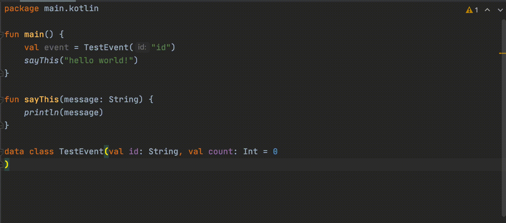

# Bulk Add Name Params 

<!-- Plugin description -->
Quickly add named parameters to all callers of a Kotlin class, method or file.

Using it is easy:

1. Place your cursor in a class or function - or in a file with top-level classes or function

2. Search for this action or choose "Bulk Add Name Params Action" from the bottom of the Code menu

3. jk, there is no step 3

<!-- Plugin description end -->

## Installation

- Using IDE built-in plugin system:
  
  <kbd>Settings/Preferences</kbd> > <kbd>Plugins</kbd> > <kbd>Marketplace</kbd> > <kbd>Search for "Kotlin Bulk Add Name Params"</kbd> >
  <kbd>Install Plugin</kbd>
  
- Manually:

  Download the [latest release](https://github.com/hbmartin/intellij-kotlin-bulk-add-name-params/releases/latest) and install it manually using
  <kbd>Settings/Preferences</kbd> > <kbd>Plugins</kbd> > <kbd>⚙️</kbd> > <kbd>Install plugin from disk...</kbd>

## Contributing

* [PRs](https://github.com/hbmartin/intellij-kotlin-bulk-add-name-params/pulls) and [bug reports / feature requests](https://github.com/hbmartin/intellij-kotlin-bulk-add-name-params/issues) are all welcome!
* This project is linted with [ktlint](https://github.com/pinterest/ktlint) via [ktlint-gradle](https://github.com/JLLeitschuh/ktlint-gradle/tags) and statically analyzed with [detekt](https://github.com/detekt/detekt)
* Treat other people with helpfulness, gratitude, and consideration! See the [JetBrains CoC](https://confluence.jetbrains.com/display/ALL/JetBrains+Open+Source+and+Community+Code+of+Conduct)

## Authors

* [Harold Martin](https://www.linkedin.com/in/harold-martin-98526971/) - harold.martin at gmail

## License

MIT License

Copyright (c) Harold Martin 2021

Permission is hereby granted, free of charge, to any person obtaining a copy
of this software and associated documentation files (the "Software"), to deal
in the Software without restriction, including without limitation the rights
to use, copy, modify, merge, publish, distribute, sublicense, and/or sell
copies of the Software, and to permit persons to whom the Software is
furnished to do so, subject to the following conditions:

The above copyright notice and this permission notice shall be included in all
copies or substantial portions of the Software.

THE SOFTWARE IS PROVIDED "AS IS", WITHOUT WARRANTY OF ANY KIND, EXPRESS OR
IMPLIED, INCLUDING BUT NOT LIMITED TO THE WARRANTIES OF MERCHANTABILITY,
FITNESS FOR A PARTICULAR PURPOSE AND NONINFRINGEMENT. IN NO EVENT SHALL THE
AUTHORS OR COPYRIGHT HOLDERS BE LIABLE FOR ANY CLAIM, DAMAGES OR OTHER
LIABILITY, WHETHER IN AN ACTION OF CONTRACT, TORT OR OTHERWISE, ARISING FROM,
OUT OF OR IN CONNECTION WITH THE SOFTWARE OR THE USE OR OTHER DEALINGS IN THE
SOFTWARE.
